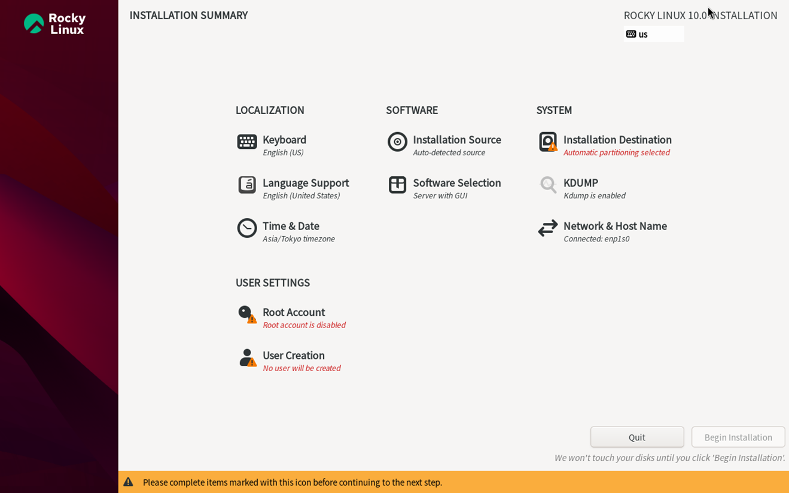

## Rocky Linux的安装以及一些初步的使用建议

***Last Updated: 2025-11-27***

**写在前面：**

**(1) 本文主要针对用户在个人计算机独自使用设备和系统的情况；**

**(2) 本文主要针对实体机，但也大体适用于虚拟机（针对虚拟机的情况我有不少关于安装系统前配置虚拟机等方面的重要说明和补充，详见[《Rocky Linux 10在虚拟机上的安装》](./vmware_installation)）。**

### 1. 下载Rocky Linux的ISO镜像

在国内尤其校园网环境下，最佳下载地址是[中科大的镜像源](https://mirrors.ustc.edu.cn/)（如果在校园网推荐切换到[IPv6版本](https://ipv6.mirrors.ustc.edu.cn/)）；进入后在列表找到rocky，然后依次：$version → isos → x86_64，点击下载“Rocky-$version -x86_64-dvd.iso”。

*（注：$version代指版本号，目前受支持的版本有8.10、9.7和10.1。我自己用的是10.1，对稳健性有较大顾虑可以选择9.7；8.10偏老，不建议用）*

### 2. 制作U盘启动盘

选择合适的写入工具将ISO写入U盘。个人强烈推荐将开源、免费的[Ventoy](https://www.ventoy.net/)作为此类工具的首选，其一大特色是使用Ventoy配置后的U盘可以直接在文件资源管理器中粘贴ISO镜像文件，非常方便。如果想用常规型工具，应当参考[Rocky Linux官方文档相应页面](https://wiki.rockylinux.org/rocky/image/)给出的推荐和避雷。

### 3. 重启电脑，加载U盘启动盘

具体操作方法因主板品牌不同而不同，此处无法一一赘述。

### 4. 设置Rocky Linux安装选项

在引导界面的“Install”和“Test media and install”中任选一个进入（个人更推荐第二个）。第一个图形界面是选择语言，强烈建议选择英文（实在想用中文也是安装好后再换）。第二个界面就是各种安装设置了，如图所示：

  

按照以下提示安装，下面没提到的不用管：

（1）“Software Selection”页面，一定要选择Workstation（工作站，附带GNOME图形界面），既功能适合还方便使用；右侧建议勾选Legacy UNIX Compatibility、Developement Tools、System Tools、Graphical Administration Tools几个选项（若版本为9.6，还会有一个“GNOME Applications”选项，建议勾选上）。

（2）“Installation Destination”页面，注意选对自己想安装到哪个硬盘上，并合理分区。如果你是双系统，强烈建议将系统装到一个单另的空白硬盘上，这样最省心，风险也最低。选择Custom选项进行手动分区，点击Done后进入分区设置界面，按如下所说设置：所有分区类型均为Standard partition，“/boot/efi”启动分区大小256MiB（也可以略大一点比如512MiB），swap分区大小8到16GiB（因机而异，这个只是针对大部分个人计算机的建议区间），剩余全部划给“/”（该分区默认文件系统为xfs；如果你是双系统，推荐改为ext4文件系统以期更方便地从Windows利用简便工具读取文件）。

（3）“Root Account”界面选择Enable并且设置密码。对于在PC上独自使用该系统的情况，如果计划直接使用root用户，“User Creation”就不用弄（但安装完后第一次进入系统会强制要求设置，此时只需设置好后再退出登录，在登陆页面点击“Not listed?”输入用户名root和密码即可，然后刚刚被强制建立的普通用户也可以在设置里删掉了）。如果计划平时就用普通用户，在“User Creation”里面作相应设置即可；需要注意，由于运行一些指令时需要管理员权限从而得在前面额外加一个“sudo”（例如通过dnf做安装/卸载/更新程序等操作），因此在“User Creation”设置中一定要勾选设置为管理员的选项，否则没有权限使用“sudo”，这些指令你执行不了。有关Rocky Linux 10中使用root用户的一些问题,我单另写了一个小博文略作阐述：[Rocky Linux 10 中使用root用户的一些简要说明、注意事项及障碍解决](./root)。

（4）“Network & Hostname”页面是连接网络的，连接后可以进入“Tima & Date”校准时间；不过这两个安装完后再弄也不迟。值得一提的是，NKU的校园网无感知认证是识别设备硬件MAC地址，因此如果你是双系统且在Windows系统下已经设置过无感知认证，在Linux下连接校园网也不会需要额外认证登录。

### 5. 一切就绪

点击“Begin Installation”开始安装。安装完毕后，点击“Reboot”，设备会重启，重启后从BIOS进入Linux（建议和3一样手动操作以免开机自动引导到其他地方）。

### 一些额外的使用建议

1. 将repo源更换为国内镜像源往往会令下载速度有明显提升，建议安装完后初次打开系统首先操作这个。个人推荐中科大镜像源（后面涉及换源操作的也都以更换至中科大镜像源为例），教程见[https://mirrors.ustc.edu.cn/help/rocky.html](https://mirrors.ustc.edu.cn/help/rocky.html)。
2. 强烈建议安装并换源完毕后首先运行 <code style="font-size: 14px;">sudo dnf update -y</code> 将系统关键组件（尤其是Linux内核即kernel）更新到最新版本。
3. 建议运行指令 <code style="font-size: 14px;">sudo dnf install epel-release -y</code> 安装EPEL，这个是Fedora专门为红帽系列的中下游分发制作的软件仓库，包含了很多重要但官方仓库没有收录的程序包，对于很多额外的功能和体验都是必需的；以及 <code style="font-size: 14px;">sudo dnf config-manager --set-enabled crb</code> 启用系统的Codeready Builder仓库，这个仓库包含一些额外的程序编译和构建所需工具。将EPEL更换为国内镜像源的教程见[https://mirrors.ustc.edu.cn/help/epel.html](https://mirrors.ustc.edu.cn/help/epel.html)。对于10.x版本，EPEL的repo文件的指向链接通常带有“{$releasever+z}”字样，这个字样可以自行去掉，你可以根据自己的需求考虑是否这样做。
4. 建议添加国内flathub源方便从GNOME Software下载一些可能需要的桌面程序。教程见[https://mirrors.ustc.edu.cn/help/flathub.html](https://mirrors.ustc.edu.cn/help/flathub.html)。
5. 推荐使用GNOME Tweaks（优化工具）和GNOME Shell Extensions（扩展工具集）来对自己系统的GNOME图形界面进行一些自定义，弥补原生GNOME桌面的一些不方便之处；在扩展工具中又建议安装Dash to Dock、GTK4 Desktop Icons NG (DING；如果是9.6版本选不带GTK4的)、AppIndicator and KStatusNotifierItem Support三个扩展。如果再在系统中安装ntfs-3g，还可以直接读取Windows系统下的硬盘和文件。上面的GNOME Tweaks和ntfs-3g均需通过EPEL安装；对于GNOME Shell Extensions，建议通过加了Flatpak仓库的GNOME Software安装Extension Manager来方便地管理。

