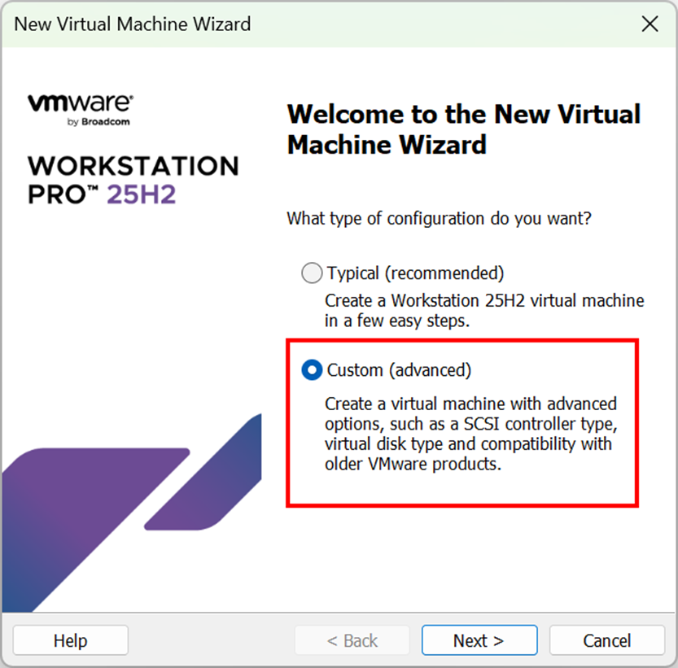
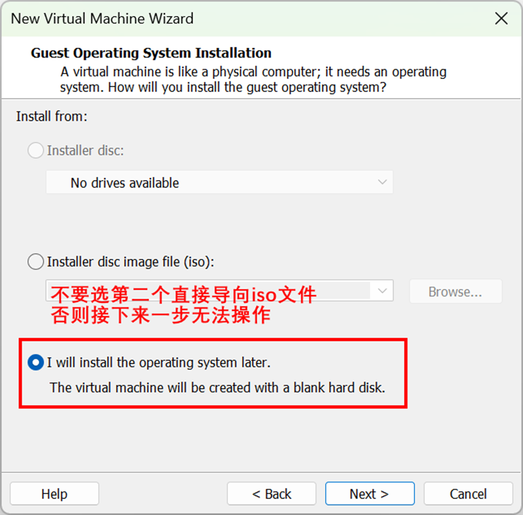
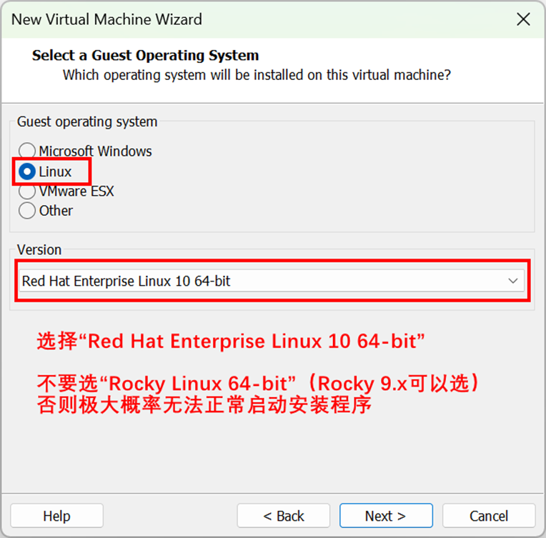
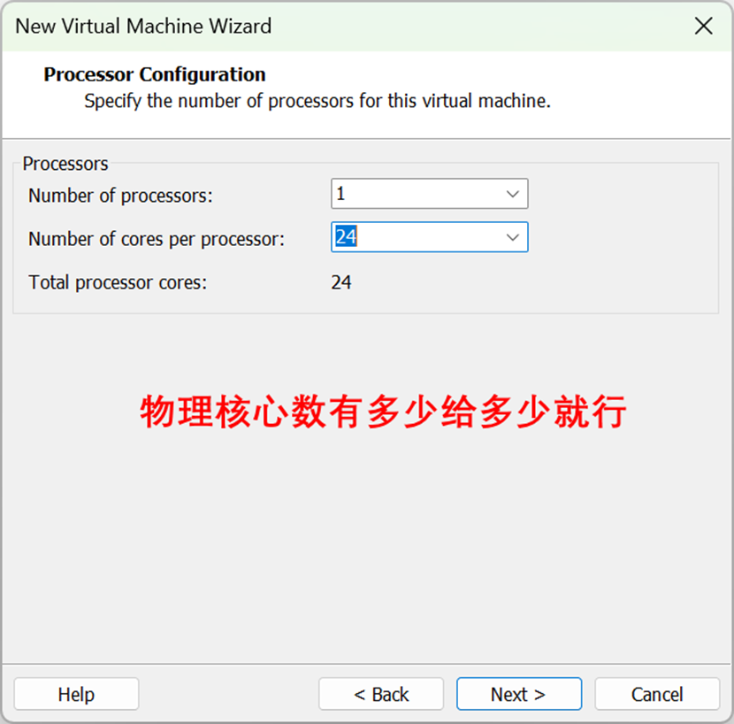
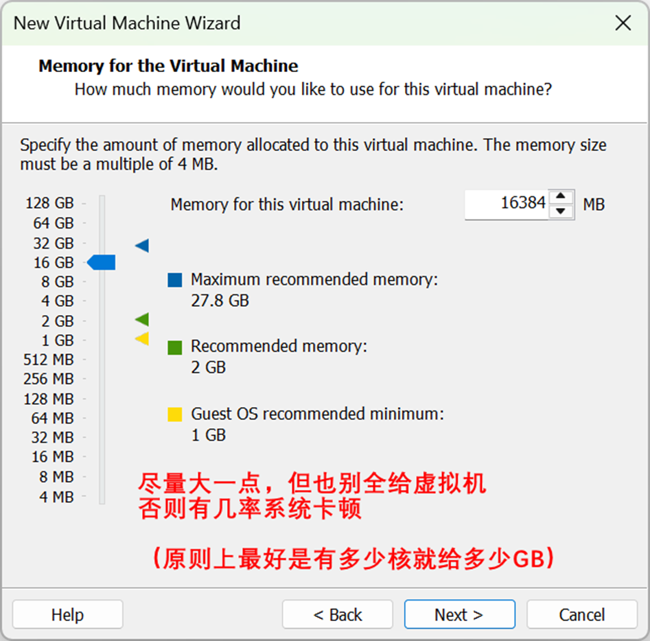
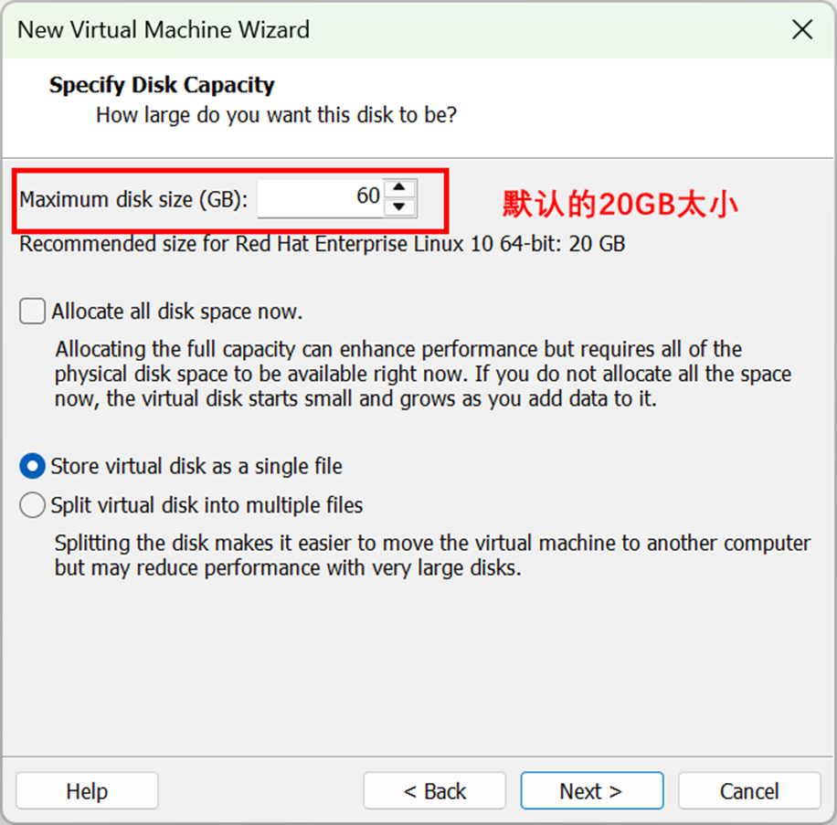
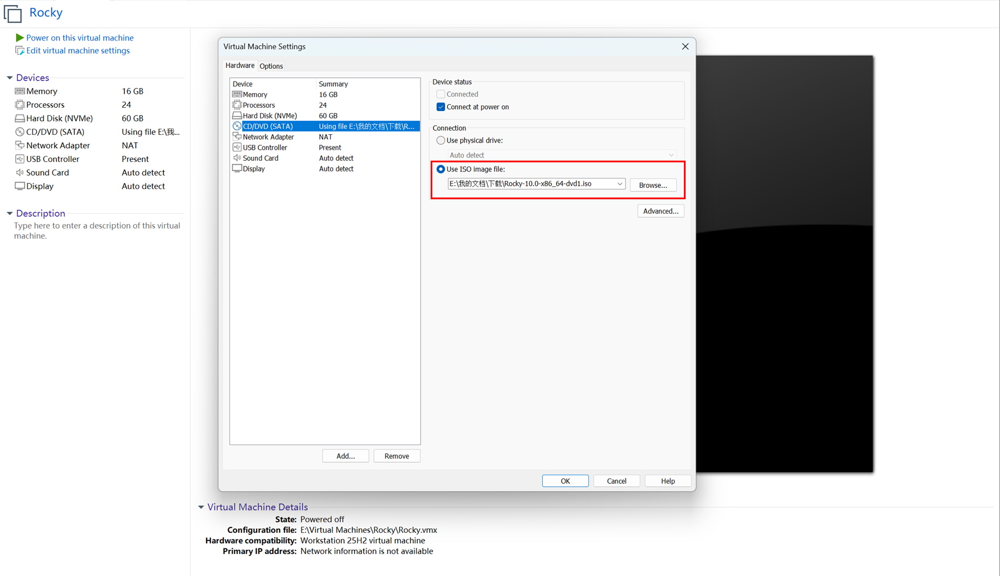

## Rocky Linux 10在虚拟机上的安装

***Last Updated: 2025-12-10***

**【写在前面：读这篇文章前吐血建议读者先认真看看我的[《Rocky Linux的安装以及一些初步的使用建议》](./installation)这篇文章，下面涉及的部分重复内容我已经在里写得很详细了，因此不再赘述，仅在有可能的不同点时加一些补充。那篇文章最后的“一些额外的使用建议”对虚拟机也一样适用。】**

### 1. 下载Rocky Linux 10的ISO镜像

### 2. 安装VMware Workstation Pro

VMware Workstation Pro对个人用户是免费的，因此直接在Broadcom Support网站上注册用户，然后下载和安装VMware Workstation Pro就行了，只是过程稍微麻烦一些。目前软件最新版本为25H2，个人认为就Rocky Linux 10的安装和使用体验来讲相对17.x版有明显改进。

### 3. 配置VMware虚拟机选项

（1）进入VMware程序，点击“Create a New Virtual Machine”；

（2）依次按下图操作：（保留默认选项即可的页面没有给出）

  
  
  
  
  
  

***2025-12-10更新：最近测试发现，上面截图第三页中选择Rocky Linux 64-bit已经可以正常启动ISO，这也意味着第二页中你可以直接选择第二个选项导向ISO镜像；只是有一个不同之处在于，VMware中RHEL选项的启动引导默认为UEFI，而Rocky选项的启动引导不支持UEFI，只能用Legacy BIOS，不过鉴于Rocky Linux两种引导都支持，故按理来讲不会造成什么实质性问题。此外，部分读者在打开虚拟机准备安装时出现了“The CPU has been disabled by the guest operating system”错误，这与自己电脑的硬件配置和系统设置有关，我自己从未遇到此问题，因此给不出解决方案；不要将这一报错错误地归因为“上面的安装步骤不对”，笔者在写这个页面时反反复复做了n多次测试，十分确信上面的操作完全没有任何问题。***

（3）按下图所示，打开虚拟机设置，手动把CD/DVD驱动器链接到ISO文件。

  

### 4. 启动虚拟机，加载系统安装映像

### 5. 设置Rocky Linux安装选项

与[《Rocky Linux的安装以及一些初步的使用建议》](/linux/rocky/installation/)里面相应部分的说明可能的不同点在于，磁盘分区一步，如果分配给虚拟机的可用空间少，可以不设置swap分区以留出更多空间给主分区“/”用。此外，由于虚拟机的网络相当于是直接使用主机的网，因此“Network & Hostname”一项无需进行任何设置。

### 6. 一切就绪

点击“Begin Installation”开始安装。安装完毕后，点击“Reboot”，虚拟机会重启，重启后就自动进入Linux了。

